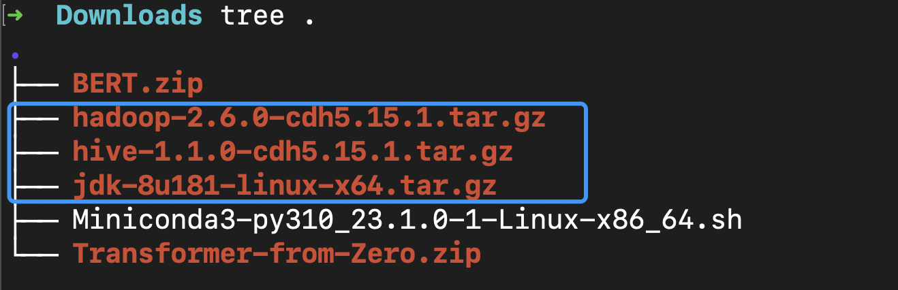
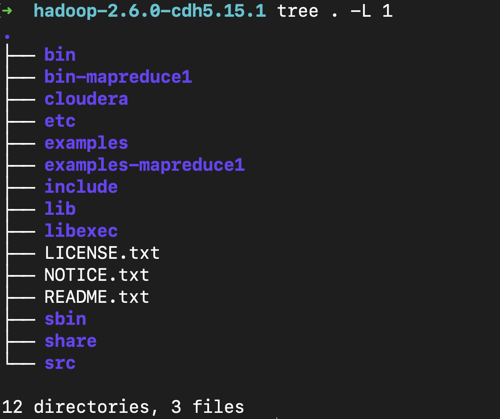

## 安装所需的文件

```shell
├── hadoop-2.6.0-cdh5.15.1.tar.gz
├── hive-1.1.0-cdh5.15.1.tar.gz
├── jdk-8u181-linux-x64.tar.gz
```




## 安装 Hadoop HDFS

1. 解压 hadoop-2.6.0-cdh5.15.1.tar.gz 
   `tar -zxvf hadoop-2.6.0-cdh5.15.1.tar.gz -C <指定路径>`
2. 添加 HADOOP_HOME 到系统环境变量
   `vim ~/.zshrc` or `vim ~/.bashrc`
3. 修改 Hadoop 配置文件


## Hadoop 软件目录



1. bin：hadoop 客户端命令
2. etc/hadoop：hadoop相关的配置文件存放目录
3. sbin：启动hadoop相关进程的脚本
4. share：常用例子

`bin` 和 `sbin` 一个是客户端用的，一个是启动 hadoop 相关服务用的


## Hadoop 运行环境 配置文件

1. etc/hadoop/hadoop-env.sh 配置 hadoop 的运行环境
   配置运行 hadoop 的 `JAVA_HOME`
   配置 hadoop 配置文件的根目录 `HADOOP_CONF_DIR` （正常情况下用默认配置即可）