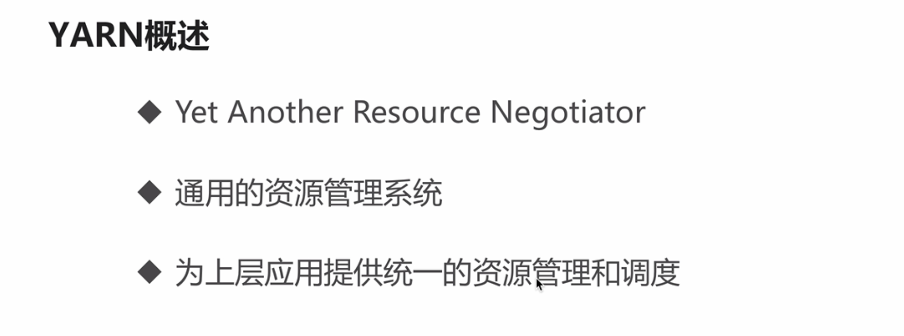
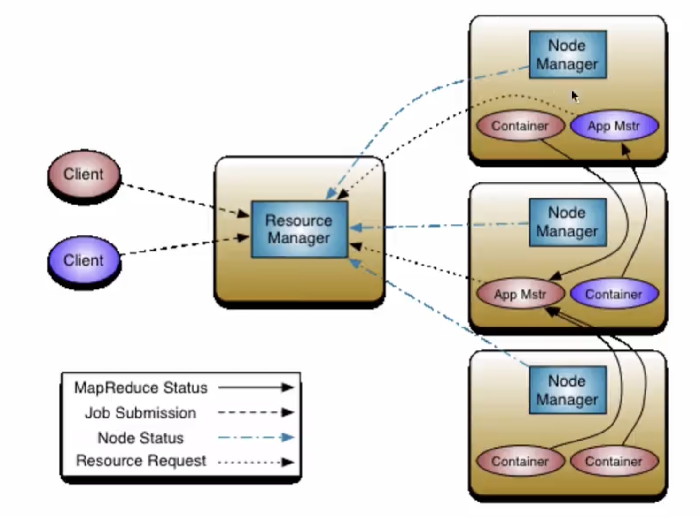
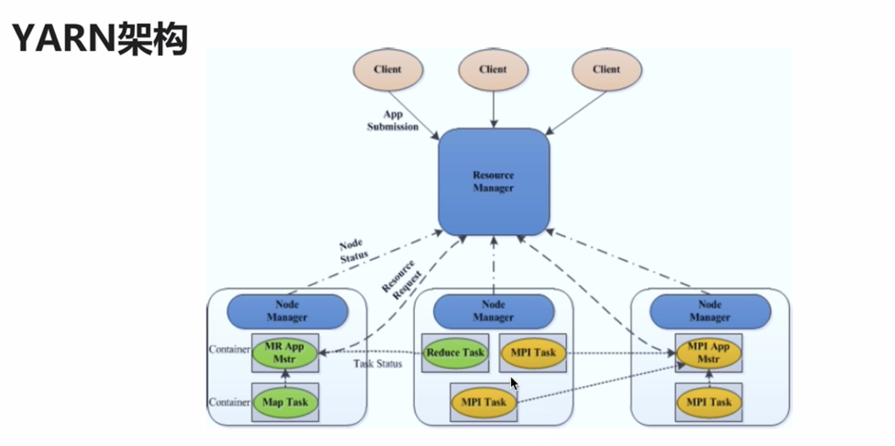
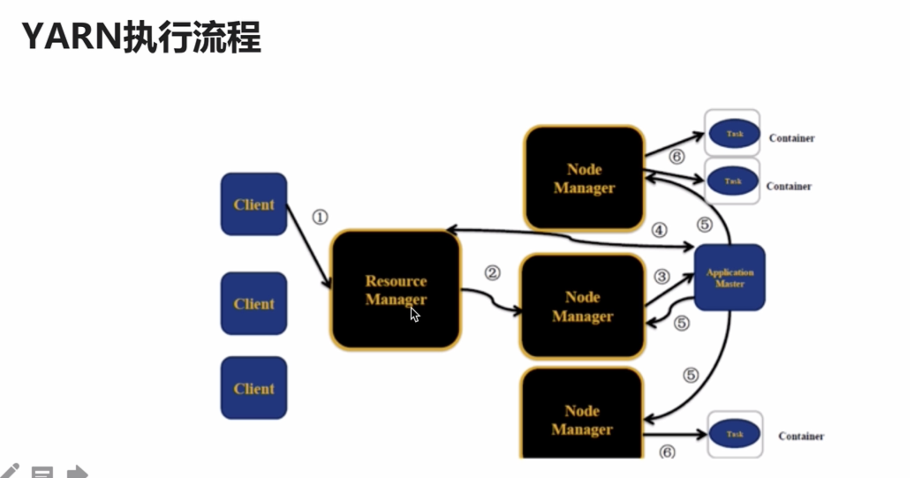

## YARN

YARN 的作用：

把 JobTracker 拆开成为 `Resource Management` 和 `Job Scheduling/Monitoring` 

还有个 概念是 `Application Master`

提交 `MapReduce` 的作业就有 `MapReduce` 的 `Application Master`
提交 `Spark` 的作业就有 `Spark` 的 `Application Master`

1. Master : Resource Management
2. Slave : Node Management (1 & 2 = Computation Framework)
3. Application Master
4. Container

## 架构图

1. `Client`: 向 `RM` 提交任务 或 杀死任务
2. Application Master : 每个应用程序对应一个 AM ; AM 会向 RM 申请资源用于启动用于在 NM 上启动对应的 Task ;  数据的切分 ； 为每个作业向 RM 申请资源（Container） ； 任务的监控
3. Node Manager : 有多个 ；干活的，并且定期向 RM 发送心跳信息、任务的执行情况、启动任务（需要接收来自 RM 的请求才会启动任务） ； 并且会来执行 AM 的请求命令
4. Resource Management : 对外提供服务用的，同一个时刻仅有一个 RM 对外提供服务，负责资源相关的，处理来自客户端的请求（提交任务、杀死任务) ； 启动或监控 AM ；

Container : 任务运行的抽象 ； 运行 AM 或者 map / reduce task

其中 Application Master 申请到的 Container 可能是在其他的机器上的 （这段话还不确定）
使用 Application Master 来管理具体的 Task 的运行情况，而不需要 Node Manager 来管理了，释放 Node Manager 的双手 ：)

## YARN 执行顺序

1. Client 向 Resource Manager 提交 Task
2. Resource Manager 向 Node Manager 发送请求，从而让 Node Manager 启动第一个 Container
3. Node Manager 收到 Resource Manager 的请求后启动 Container 并在其中运行 Application Master ; 图中的 Application Master 是运行在 Container 中的
4. Application Master 被启动后，首先自己去注册到 Resource Manager 中（RM 是用来管理全局资源的），Applicatoin Master 可以直接与 Resource Manager 进行通信 ； 此时 Client 可以直接通过 Resource Manager 查询到 Application Master 的运行情况 ; 第 4 步的箭头是双向的， Application Master 向 Resource Manager 申请资源，如果申请到了资源，那么箭头回来告诉 Application Master 已经申请到了资源
5. Applicatoin Master （map/reduce Application Master 或者 Spark Applicaiton Master）向三个 Node Manager 申请启动 Container ，从而在 Container 中运行一个 Task （启动的每一个 Task Container 的运行情况都要告诉启动它的 Application Master ， 如果挂掉了就要重新启动）
6. Node Master 启动 Task Container